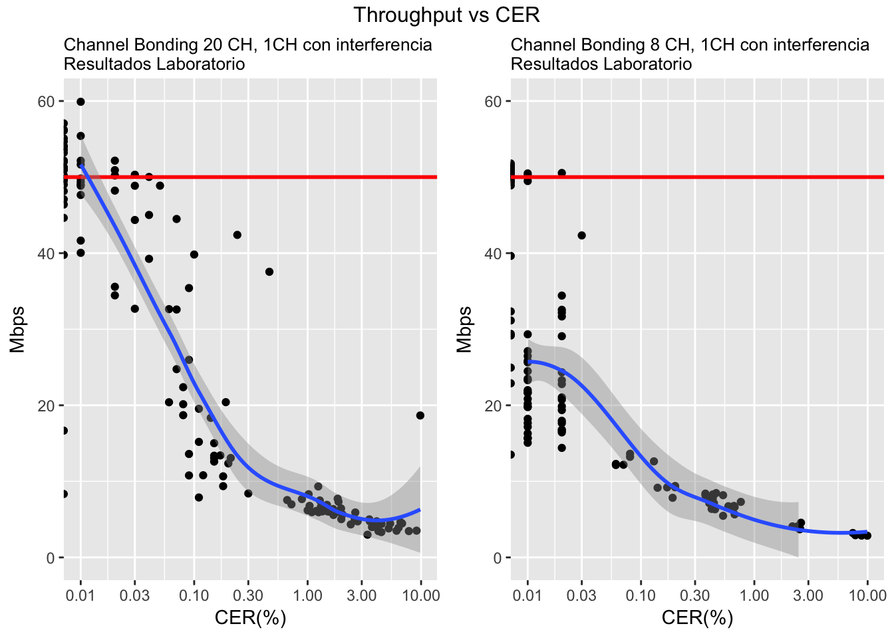
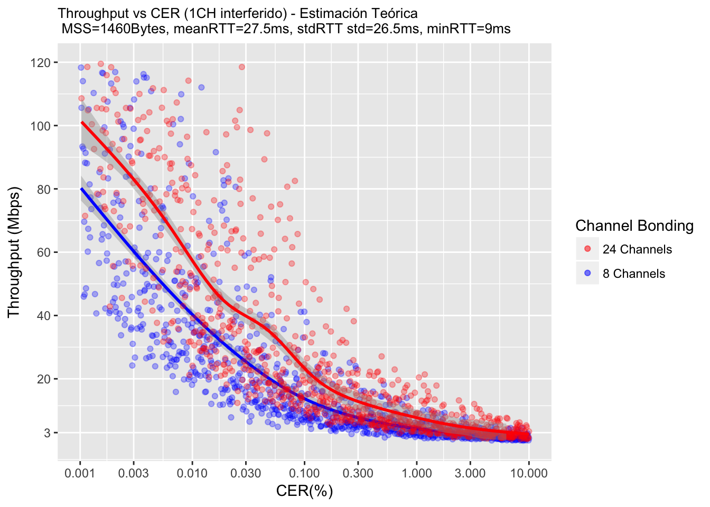
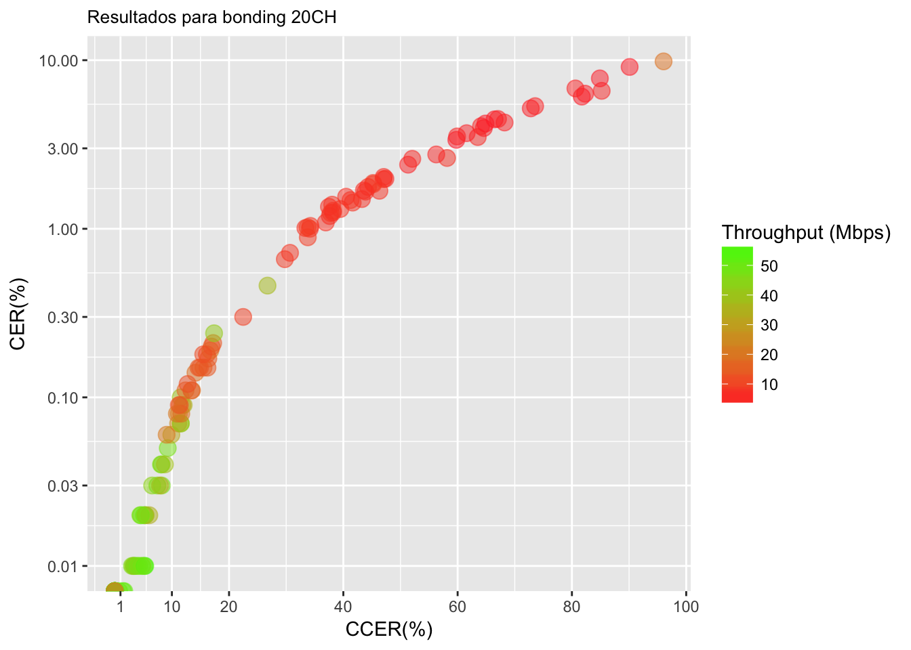
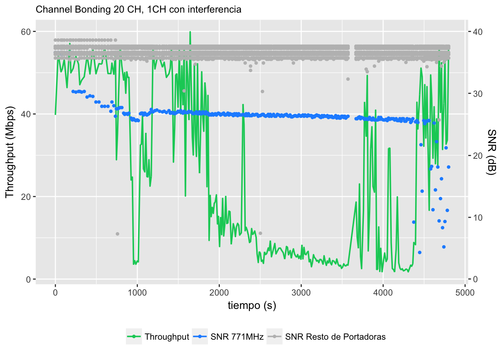
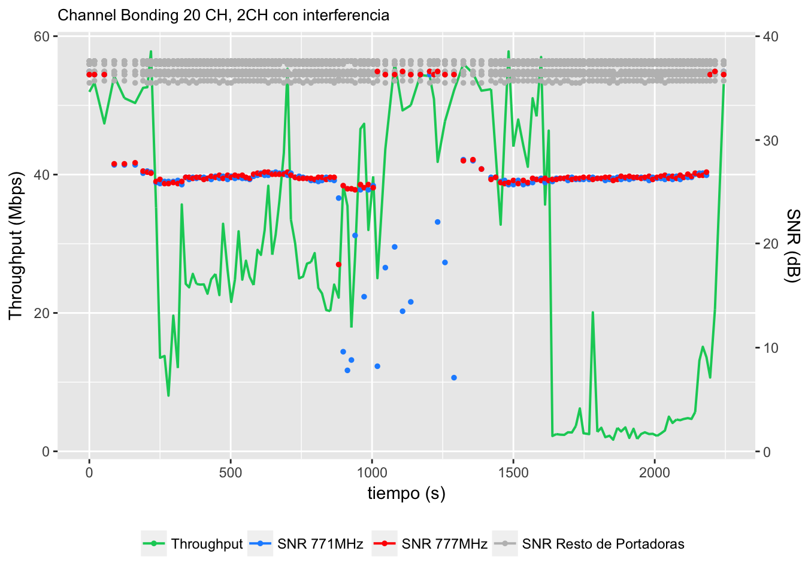
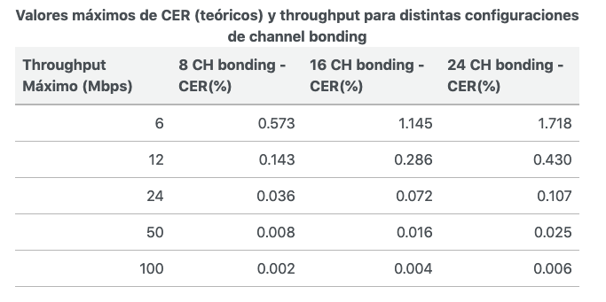

Cuando se habla de Throughput TCP en `Docsis` se sabe que está en función del CER y del CCER ademas de las variables de la session TCP. Adicionalmente, en `Docsis 3.0` aparece otra variable en juego mediante lo que se conoce como *Partial Service*. En este post se discute brevemente como interactuan todas estas variables en el Throughput final.

# Throughput TCP 

Teóricamente el Throughput $T$ puede aproximarse como:

$$T_{tcp}= \dfrac{mss}{rtt}*\dfrac{1}{\sqrt{p}} $$

Donde el valor de $p$ (paket loss) está en función del  número de portadoras o canales $n_{ch}$ en *bonding*, de modo que:

$$ p \approx cer*\dfrac{ip_{size}}{codeword{size}} *\dfrac{1}{n_{ch}} \approx \dfrac {7 * cer}{n_{ch}}$$

Por ejemplo, el siguiente experimento muestra el Throughput TCP obtenido para distintos valores de CER y distintas configuraciones de *channel bonding*

La siguiente figura muestra una *estimación teórica* del Throughput TCP obtenido en laboratorio para distintos valores de CER y distintas configuraciones de *channel bonding*. El valor máximo de Throughput del CM es de 50 Mbps

# CER/CCER

El CER y el CCER representan el porcentaje de `codewords` con errores y `codewords` con errores pero que pudieron corregirse gracias al FEC, respectivamente. 

Teóricamente, se puede decir que el CER afecta el servicio, ya que los errores no pueden rescatarse, mientras que el CCER no, ya que son los `codewords` que pudieron recuperarse. Sin embargo en la pràctica, nunca se da CER sin CCER, con lo cual la exitencia de una de estas variables ya implica un deterioro en el servicio. La siguiente figura muestra el resultado de un experimento de esta observacion, cada valor de CER tiene asociado un valor de CCER que a su vez disminuye impacta en el Throughput TCP.

# Partial Service

*Partial Service* (PS) es un comportamiento definido en el estandar `Docsis 3.0` que permite que una de las portadoras usadas en el *channel bonding* sea ignorada en caso de que no presente una buena salud de red. Esta desición es tomada por el CMTS en función de la información entregada por el CM. Específicamente para downstream, una portadora es ignorada cuando un CM no puede sincronizarse con el clock de la portadora, lo que tipicamente sucede cuando el `SNR` < 25 dB.

El objetivo de Partial Service es que las portadoras con problemas dejen de usarse para que el CER/CCER no impacten en el Throughput TCP. Sin embargo en la practica, las portadoras entran en PS solo con interferencias o ruidos muy fuertes, de modo que funcionan una gran cantidad de tiempo con CER/CCER. 

Lo descrito previamente se observa en las siguientes figuras que resumen un experimento que muestra como evolucionó el throughput TCP de un CM para distintos valores de SNR en la portadora 771 y 777 MHz. En la Fig. A, a partir del tiempo 4500(s) el throughput TCP se recupera debido a que las portadoras con interferencia tienen tan bajo SNR que entran en PS. En la Fig. B ocurre lo mismo entre el tiempo 1000(s) y 1600(s)

Fig. A

Fig. B

## Throughput final

El throughput TCP para `Docsis 3.0` se vuelve mas resilente a medida que aumentan las portadoras del *bonding*, es decir, el CER/CCER impacta menos a medida que crece el *channel bonding*. Esto se sintetiza en la siguiente tabla:

Típicamente, el CER/CCER afectará el throughput siempre y cuando las portadoras con problemas estén operativas. En el momento que las portadoras entran a Partial Service, el throughput se recupera (aunque se pierde la capacidad total del Bonding). Para que un CM entre en Partial Service en una de sus portadoras, se requiere un SNR < 25 dB.
