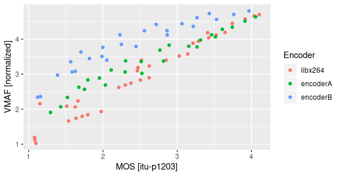
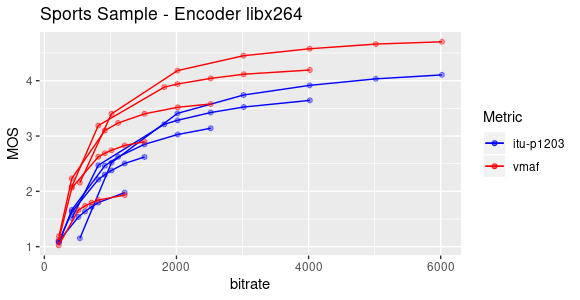
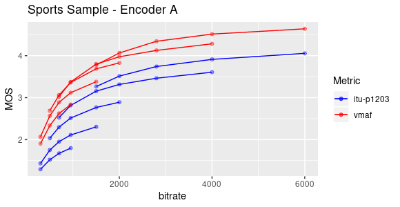
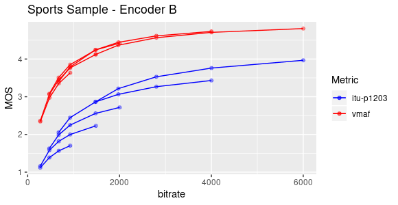
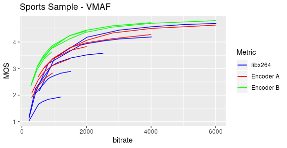
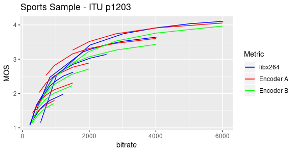

 
VMAF [[1]](https://github.com/Netflix/vmaf) has become one of the most usefull tools [[2]](https://netflixtechblog.com/vmaf-the-journey-continues-44b51ee9ed12) for video quality assessment (VQA). Particularly, as a *full reference metric*,  it has been widely used  on *VoD assets* where the *VoD sources* are easily available. However, for *live streams*, VMAF has a couple of drawbacks, i. e., the access to *live sources* could be impossible in a synchronized way and even if we can solve this, it would be computationally expensive. To deal with these issues, there are many of *Non  Reference metrics* on the market. I will briefly tackle on ITU-P1203.1 by using its implementation publicly available at GitHub [[3]](https://github.com/itu-p1203/itu-p1203).

ITU-T Rec. P.1203 is a standard for measuring the Quality of Experience of HTTP Adaptive Streaming services. It has been trained and validated in order to deliver the best possible prediction of QoE for transmissions that contain initial loading, stalling, and quality variations. For the purposes of these tests, the artifacts due network transmissions (loading, stalling) will be not taken into account. The ITU-T Rec. P.1203.1 mode 3, defines a *non reference metric* for HD videos encoded as AVC.

Note: For 4K with other codecs than AVC, ITU-T Rec. P.1204 should be used.

## Use cases

Typically, I use VQ metrics to (i) measure the impact of encoding settings over the video streams, (ii) to do a benchmarking between different encoders and (ii) to define the bitrate ladder for ABR services. In this way, I'm going to analyze ITU-P1203.1 vs VMAF by taking into account just the use cases previously described.

## Methodology

I'm particularly interested on how visual metrics works for *live streams*. In this way I've used as a video source a short video of 60 seconds duration that contains a subsample of a soccer match (futbol). Typically, soccer matches have high complexity scenes that are  perfect to test how an encoder behaves. Additionally, sports events are the most common use cases for *OTT live services*.

On the other hand, three different encoders engines/implementations were tested, all of them using the same video sample. One of the tested encoders was the open `libx264` implementation. The two remaining encoders were private implementation and will be called *Encoder A* and *Encoder B*. Each encoder has its own vendor specific features that are not relevant for these tests, i. e., the main idea is to analyze VMAF/ itu-p1203 scores given the same video sample and the same encoder . For each encoder, several resolutions and bitrates were configured and the visual quality at the output was measured. Neither frame loss nor packet loss were introduced, so just the artifacts due video compression losses will be measured.

Finally, for vmaf tests the default model (`model/vmaf_v0.6.1.pkl`) was used  and for ITU-P1203.1, the `mode 3` (full bitstream analysis) was used. In order to normalize booth metrics, vmaf scores were normalized to a 0-5 scale ().

## Results

The following results are not intended to define what model fits better with a real MOS. I'm just comparing the relationship between VMAF and ITU-P1203 scores. These results could help to understand the constraints for each model and some warnings to take into account when we used it.

### Vmaf vs ITU-P.1203

Generally speaking, itu-p1203 seems to output lower scores than Vmaf. The average difference between booth scores seems to depend on the codec implementation of the tested video. It was found that the best match between booth metrics happens with `libx264` encoder (see figure below).   This has sense given that *itu-p1203* model was trained with `libx264`.

Additionally, It must be taken into account that VMAF could boost the scores if the encoder does picture enhancement techniques [[4]](https://docs.google.com/document/d/1dJczEhXO0MZjBSNyKmd3ARiCTdFVMNPBykH4_HMPoyY/edit). Unfortunately, I can't be sure if the Encoders A/B on the tests implement some image enhancement by default (there are vendor specific implementations). In the near future, apparently  this bias could be solved with a new vmaf feature/model [[5]](https://github.com/Netflix/vmaf/issues/661#issuecomment-685993791).

### Vmaf/ITU-P.1203 vs bitrate

A common use case of visual quality analysis is the bitrate ladder definition for ABR services. This typically is done by getting the convex hull of the encoder under test. In the next figures, I will briefly compare the convex hulls obtained from VMAF and ITU-P.1203 scores.

Notice that in particular for *Encoder B* (as we saw before), VMAF scores are pretty high in comparison with itu-p1203 and additionally, the convex hull obtained from booth metrics are different.

### Vmaf/ITU-P.1203 as tool for encoder benchmarking

It calls my attention that regarding what metric was used (VMAF or itu-p1203), we could reach different conclusions when we do benchmarking between encoders: If vmaf is used as reference metric, the best bitrate efficiency would be reached by encoder B, however if we use ITU-P.1203, encoder B would be located at the end of the ranking. This is shown in the next figures.

Given my experience with the tested encoders, I personally believe that Encoder B could produce higher VMAF scores than real MOS due to  image picture enhancement techniques. However, the real MOS shouldn't be so lower as predicted by itu-p1203.

## Discussion

I suggest to use either VMAF and  itu-p1203 as **reference metrics within the same encoder implementation** and to use their scores as relatives values  instead of absolutes ones, i. e., within the same encoder you could choose what encoding setting gives better MOS based on either vmaf or itu-p1203, however you would still need to validate if that score is enough for your quality requirements.
 
On the other hand, for encoders benchmarking the state of the art seems to have some constraints yet but I believe that VMAF could be still the better and more scalable choice for a while, i. e., The option to fix the inaccuracy due picture enhancement seems to be almost ready and even if it is not enough, you could train your own model on an independent way of the encoders implementations.

